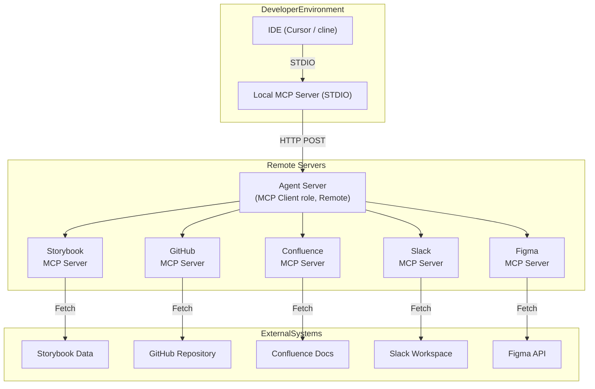

# devpulse-agent

## System Architecture

```mermaid
flowchart TD
  subgraph DeveloperEnvironment
    IDE["IDE (Cursor / cline)"]
    Local_MCP_Server["Local MCP Server (STDIO)"]

    IDE -->|STDIO| Local_MCP_Server
  end

  subgraph Remote Servers
    Agent_Server_mastra["Agent Server<br/>(MCP Client role, Remote)"]
    Storybook_MCP["Storybook<br/> MCP Server"]
    GitHub_MCP["GitHub<br/> MCP Server"]
    Confluence_MCP["Confluence<br/> MCP Server"]
    Slack_MCP["Slack<br/> MCP Server"]
    Figma_MCP["Figma<br/> MCP Server"]

    Local_MCP_Server -->|HTTP POST| Agent_Server_mastra
    Agent_Server_mastra --> Storybook_MCP
    Agent_Server_mastra --> GitHub_MCP
    Agent_Server_mastra --> Confluence_MCP
    Agent_Server_mastra --> Slack_MCP
    Agent_Server_mastra --> Figma_MCP
  end

  subgraph ExternalSystems
    Storybook_Data["Storybook Data"]
    GitHub_Repo["GitHub Repository"]
    Confluence_DB["Confluence Docs"]
    Slack_Workspace["Slack Workspace"]
    Figma_API["Figma API"]

    Storybook_MCP -->|Fetch| Storybook_Data
    GitHub_MCP -->|Fetch| GitHub_Repo
    Confluence_MCP -->|Fetch| Confluence_DB
    Slack_MCP -->|Fetch| Slack_Workspace
    Figma_MCP -->|Fetch| Figma_API
  end
```
