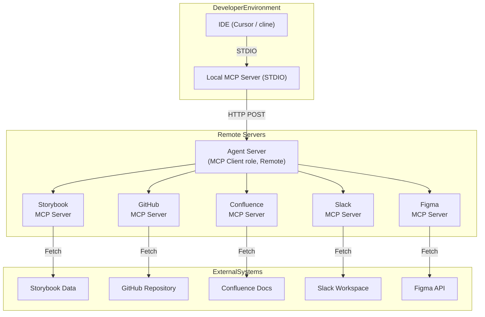

# devpulse-agent

## System Architecture

## Slack Search Agent

The `SlackSearchAgent` is designed to connect to a Slack workspace, index conversations, and provide a search functionality over the indexed messages using a Retrieval Augmented Generation (RAG) approach.

### Configuration

To use the `SlackSearchAgent`, the following environment variables must be configured:

*   **`SLACK_BOT_TOKEN`**:
    *   **Purpose**: This token allows the agent to authenticate with the Slack API and access channel history.
    *   **How to obtain**:
        1.  Create a new Slack App in your workspace.
        2.  Navigate to "OAuth & Permissions" for your app.
        3.  Add the following Bot Token Scopes:
            *   `channels:history` (to read messages from public channels)
            *   `groups:history` (to read messages from private channels, if the bot is a member)
            *   `im:history` (to read messages from DMs, if the bot is a member)
            *   `mpim:history` (to read messages from group DMs, if the bot is a member)
            *   `channels:read` (to list public channels)
            *   `users:read` (to get user information, optional but can be helpful)
        4.  Install the app to your workspace.
        5.  The "Bot User OAuth Token" provided is your `SLACK_BOT_TOKEN`. It typically starts with `xoxb-`.

*   **`HF_TOKEN`**:
    *   **Purpose**: This token is required to authenticate with the Hugging Face Inference API, which is used to generate embeddings (vector representations) of the Slack messages. These embeddings are essential for the semantic search functionality.
    *   **How to obtain**:
        1.  Create an account on [Hugging Face](https://huggingface.co/).
        2.  Navigate to your account settings, then to "Access Tokens".
        3.  Generate a new token (read or write scope should be sufficient). This token is your `HF_TOKEN`.

### Available Tools

The agent exposes the following tools:

1.  **`indexSlackConversationsTool`**:
    *   **Description**: Indexes conversations from Slack channels. It fetches messages, converts them into vector embeddings using Hugging Face models, and stores them in an in-memory FAISS vector store.
    *   **Parameters**:
        *   `channelId` (string, optional): The ID of a specific Slack channel to index. If this parameter is omitted, the tool will attempt to fetch and index messages from all accessible public channels.
        *   `limitPerChannel` (number, optional, default: 50): The maximum number of recent messages to fetch and index from each channel.
    *   **Usage Notes**: This tool needs to be run to populate the vector store before search can be effective. Re-running it can update the index with newer messages.

2.  **`searchIndexedConversationsTool`**:
    *   **Description**: Searches the previously indexed Slack conversations using a natural language query.
    *   **Parameters**:
        *   `query` (string, required): The search query or question you want to ask about the conversations.
    *   **Usage Notes**: This tool performs a similarity search in the vector store to find relevant message chunks. These chunks are then used as context for a language model (e.g., GPT-4o) to generate a comprehensive answer (Retrieval Augmented Generation).

### Important Notes

*   **In-Memory Vector Store**: The current implementation uses FAISS as an in-memory vector store. This means that any indexed data is lost when the agent server restarts. Future enhancements may include options for persistent storage of the index.
*   **Internet Access**: The agent requires internet access to communicate with the Hugging Face Inference API for generating embeddings, unless a local embedding model setup is used (which is not the default configuration).
