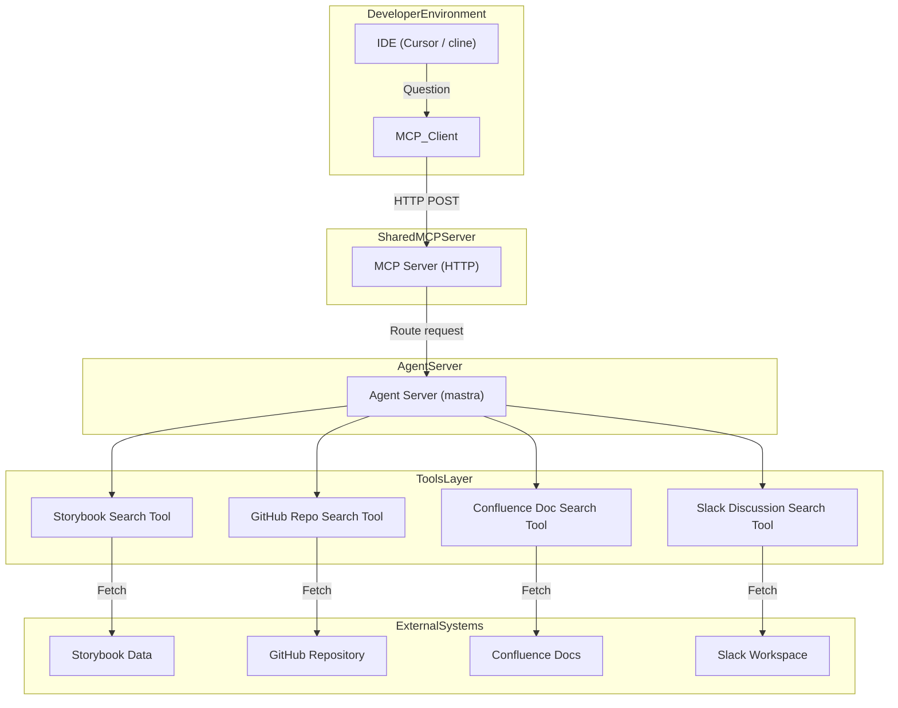

# devpulse-agent

## System Architecture

```mermaid
flowchart TD
  subgraph DeveloperEnvironment
    IDE["IDE (Cursor / cline)"]
    IDE -->|Question| MCP_Client
  end

  subgraph SharedMCPServer
    Shared_MCP_Server["MCP Server (HTTP)"]
    MCP_Client -->|HTTP POST| Shared_MCP_Server
  end

  subgraph AgentServer
    Agent_Server_mastra["Agent Server (mastra)"]
    Shared_MCP_Server -->|Route request| Agent_Server_mastra
  end

  subgraph ToolsLayer
    Storybook_Tool["Storybook Search Tool"]
    GitHub_Tool["GitHub Repo Search Tool"]
    Confluence_Tool["Confluence Doc Search Tool"]
    Slack_Tool["Slack Discussion Search Tool"]

    Agent_Server_mastra --> Storybook_Tool
    Agent_Server_mastra --> GitHub_Tool
    Agent_Server_mastra --> Confluence_Tool
    Agent_Server_mastra --> Slack_Tool
  end

  subgraph ExternalSystems
    Storybook_Data["Storybook Data"]
    GitHub_Repo["GitHub Repository"]
    Confluence_DB["Confluence Docs"]
    Slack_Workspace["Slack Workspace"]

    Storybook_Tool -->|Fetch| Storybook_Data
    GitHub_Tool -->|Fetch| GitHub_Repo
    Confluence_Tool -->|Fetch| Confluence_DB
    Slack_Tool -->|Fetch| Slack_Workspace
  end
```
